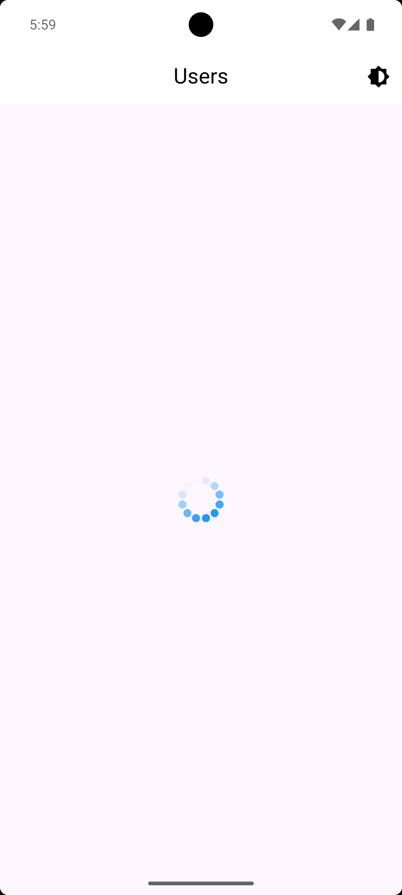
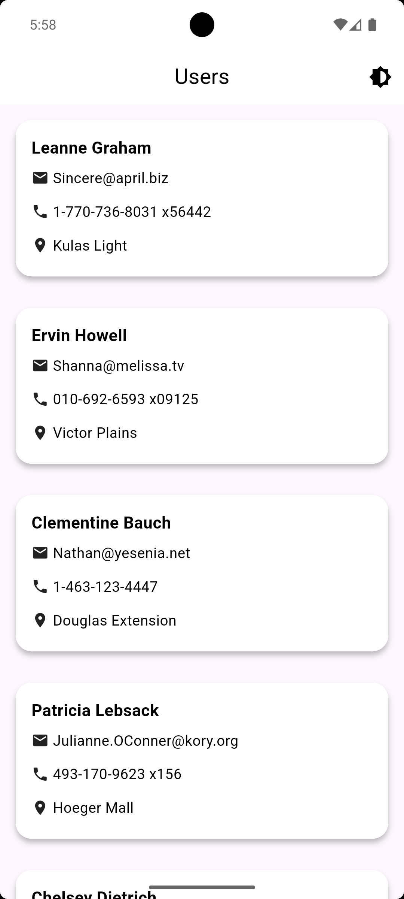
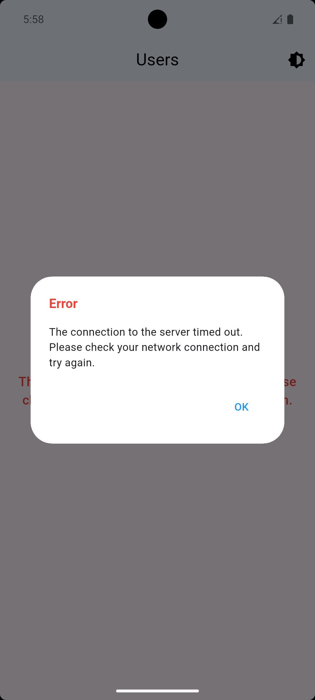
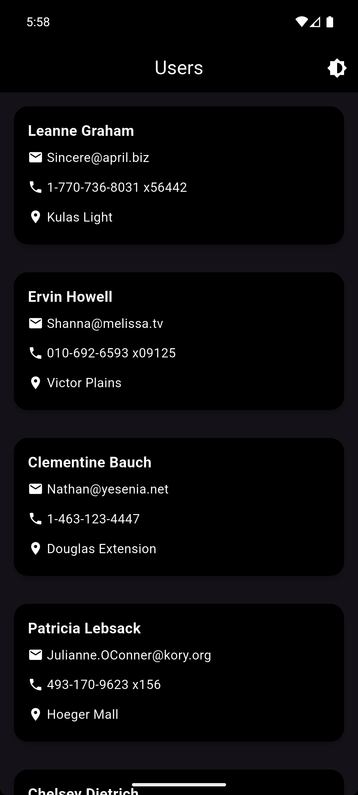

# Users Task Project

This Flutter project demonstrates fetching users from an API with different UI states:
- Loading state
- Users list state
- Failure state
- Dark theme style

## 📸 Screenshots

| Loading | Users List |
|---------|------------|
|  |  |

| Failure | Dark Theme |
|---------|------------|
|  |  |
