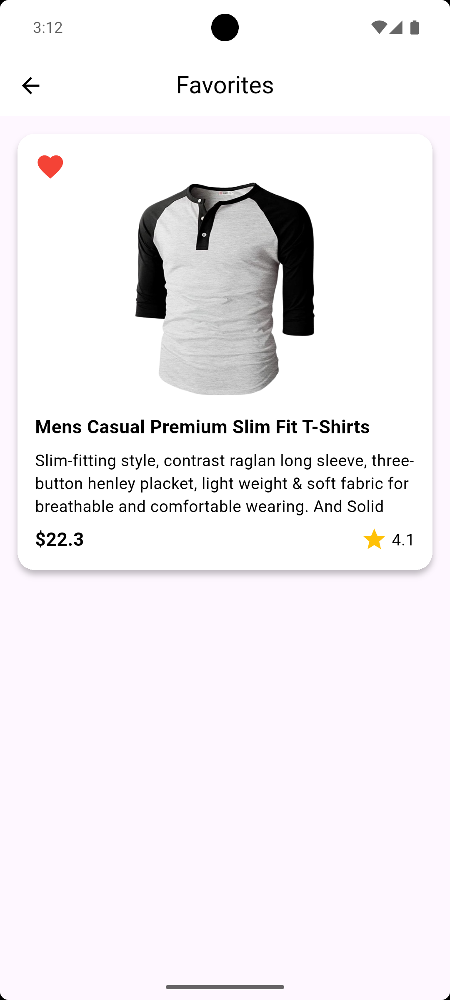

# Products Task Project

This Flutter project demonstrates fetching Products from an API with different UI states:
- Favotite state
- Products list state
- Login state

## 📸 Screenshots

| Favorite | Products List |
|---------|------------|
|  |  |

| Login |
|---------|
|  
